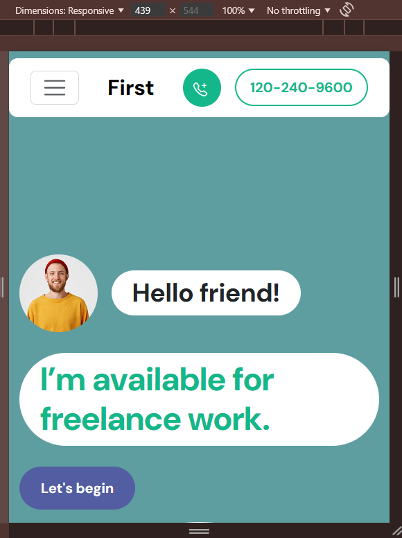

# Responsive Website Task using Bootstrap

This task demonstrates how Bootstrap’s responsive grid system and utility classes can save time and simplify responsive design. Instead of writing custom @media queries 😅, I leveraged Bootstrap to ensure the layout automatically adapts to various screen sizes — from full desktop to mobile.

## Screenshots
- **Desktop View:** 
- **Mobile View:** 

## Features
- Utilizes Bootstrap’s built-in classes for responsiveness (container, row, col, etc.).

- Significantly reduced the need for custom media queries, saving development time.

- Ensures a smooth and consistent user experience across devices.

## Files
- `Website.html` - Contains the structure of the webpage.
- `Website.css` - Includes media queries for responsiveness.

## How to Run
Simply open the `Website.html` file in any browser to view the responsive design in action.

