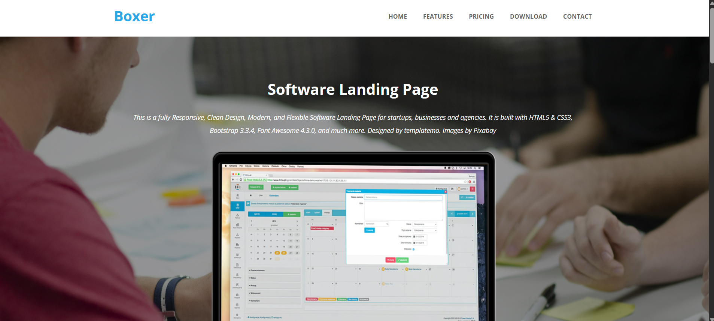
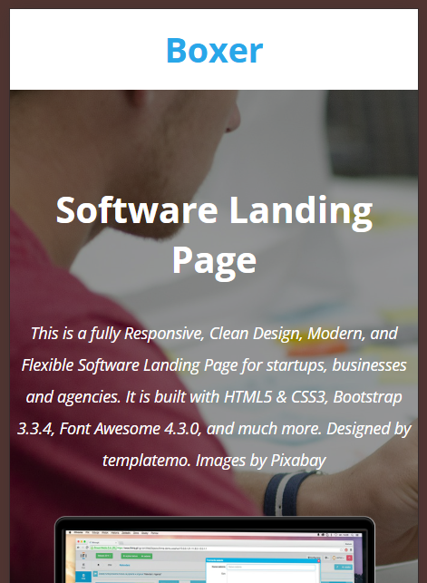

# Media Query Task

This task demonstrates the use of CSS media queries to create a responsive design. The layout adapts to different screen sizes, ensuring a proper display on both full-screen and mobile views.

## Screenshots
- **Desktop View:** 
- **Mobile View:** 

## Features
- Uses `@media` queries to adjust styles for different screen sizes.
- Ensures better user experience on various devices.

## Files
- `Website.html` - Contains the structure of the webpage.
- `Website.css` - Includes media queries for responsiveness.

## How to Run
Simply open the `Website.html` file in any browser to view the responsive design in action.

